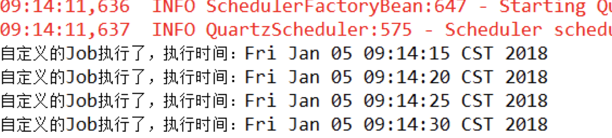

## Quartz任务调度框架

[官方网站](http://www.quartz-scheduler.org)
### 概述

Quartz是OpenSymphony开源组织在Job scheduling领域又一个开源项目，它可以与J2EE与J2SE应用程序相结合也可以单独使用。Quartz可以用来创建简单或为运行十个，百个，甚至是好几万个Jobs这样复杂的程序。Jobs可以做成标准的Java组件或 EJBs。Quartz的最新版本为Quartz 2.3.0。

### 应用

1. **使用场景**
	
	在JavaEE系统中,我们会经常用到定时任务,比如每天凌晨生成前天报表,每一小时生曾汇总数据等等.
	
	我们可以使用Java.util.TimerTask来完成这项工作,但是调度时非常不方便,并且我们需要大量的代码.
	
	使用Quartz框架无疑是非常好的选择,并且与Spring可以非常方便的集成,下面介绍他们集成方法和Cron表达式的详细介绍.
	
	
2. **具体使用(Spring集成Quartz定时任务框架介绍和Cron表达式详解)**

	**maven坐标**
	
	```
	<dependency>
		<groupId>org.quartz-scheduler</groupId>
		<artifactId>quartz</artifactId>
		<version>2.2.1</version>
	</dependency>
	<dependency>
		<groupId>org.quartz-scheduler</groupId>
		<artifactId>quartz-jobs</artifactId>
		<version>2.2.1</version>
	</dependency>
	```
	
	自定义job
	
	```
	public class MyJob{
		public void run(){
			System.out.println("自定义的Job执行了,执行时间:" + new Date());
		}
	}
	```
	
	注册自定义Job
	
	```
	<bean id="myJob" class="com.zxyuan.jobs.MyJob"/>
	```
	
	注册JobDetail,作用是负责通过反射调用指定的Job
	
	```
	<bean id="jobDetail" class="org.springframework.scheduling.quartz.MethodInvokingJobDetailFactoryBean">
		<!-- 注入目标对象 -->
		<property name="targetObject" ref="myJob"/>
		<!-- 注入目标方法 -->
		<property name="targetMethod" value="run"/>
	</bean>

	```
	
	触发器配置 时间指定
 	
 	```
 	<!-- 注册一个触发器，指定任务触发的时间 -->
	<bean id="myTrigger" class="org.springframework.scheduling.quartz.CronTriggerFactoryBean">
		<!-- 注入JobDetail -->
		<property name="jobDetail" ref="jobDetail"/>
		<!-- 指定触发的时间，基于Cron表达式 每5秒执行一次-->
		<property name="cronExpression">
			<value>0/5 * * * * ?</value>
		</property>
	</bean>

 	```
 	
 	注册调度工厂 通过这个调度工厂调度任务
 	
 	```
 	<!-- 注册一个统一的调度工厂，通过这个调度工厂调度任务 -->
	<bean id="scheduler" class="org.springframework.scheduling.quartz.SchedulerFactoryBean">
		<!-- 注入多个触发器 -->
		<property name="triggers">
			<list>
				<ref bean="myTrigger"/>
			</list>
		</property>
	</bean>

 	```
 	
 	测试
 	
 	```
 	public class App{
 		public static void main(String[] args){
 			new ClassPathXmlApplicationContext("ApplicationContext.xml");
 		}
 	}
 	```
 	
 	运行结果
 	
 	
3. **Cron表达式(七子表达式)的详细用法**

	==秒 分 时 日 月 星 年==

		
	|  字段  |  允许值  |  允许的特殊字符  |
	| :---: |:-------:| :-------------:|
	| 秒 | 0-59 | , - * / |
	| 分 | 0-59 | , - * / |
	| 时 | 0-23 | , - * / |
	| 日 | 1-31 | , - * ? / L W C |
	| 月 | 1-12或JAN-DEC | , - * / |
	| 星 | 1-7或SUN-SAT | , - * ? / L C # |
	| 年 | 空或1970-2099 | , - * / |
	
	*_注:星期,1表示星期天,7表示星期六_*
	
	[Cron表达式在线生成器](http://cron.qqe2.com)
	
* 	特殊符号含义
	
	"*"星号表示 **所有**
	
	","逗号表示 **或者** 
	
	"#"井号表示 **第几个** 6#3表示每个月的第三个星期五 
	
	"W"W表示 **工作日** 15w表示距离15号最近的工作日
	
	"L"L表示 **最后** 表示每个月或每个星期的最后一天, **特殊**:2L表示当月的最后一个星期一
	
	"/"斜线表示 **递增** 0/10 ----0表示起始,10表示增量大小
	
	"-"中线表示 **区间** 0-10 ----表示0,1,2,3,4,5,6,7,8,9,10
	
	"?"问号表示 **放弃** 问号只能使用在日和周的位置出现,并且只能出现一次
	
	**例子:**
	
	0/5****?   每5秒执行一次

* 	表达式举例
	
	
	"0 0 12 * * ?" 每天中午12点触发
	
	"0 15 10 ? * *" 每天上午10:15触发
	
	"0 15 10 * * ?" 每天上午10:15触发
	
	"0 15 10 * * ? *" 每天上午10:15触发
	
